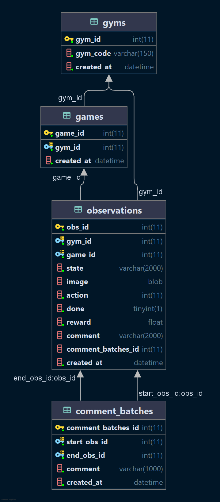

# gameXRL
Repo for white paper XRL
## Web Interface
### Pre-install dependencies
- Install requirements
```
pip install -r requirements
```
### Setup Database
- Create Database
  - Change ```mode='local'``` if you want to run on the local database
```
python db/create_db.py
```
- Look for function ```save_obs_to_db()``` in ```agent/test.py``` to see how to insert an observation into the database.
- Create more API functions in ```db/api.py```
- Run web server
```
python app/routes/routes.py
```


## Architecture
    .
    ├── ...
    ├── agent                           # Rainbow Agent  
    ├── app              
    │   ├── routes         
    │   │   ├── forms.py                # Create form to fill from front-end form
    │   │   ├── routes.py               # Run main from here (contains controller)
    │   ├── templates            
    │   │   ├── _formhelpers.html       # Render forms
    │   └────── index.html              # Index page
    ├── db                              # Database
    │   ├── api.py                      # API query to insert/read data from database
    │   ├── connect_db.py               # Connect to database through a SSHTunnelForwarder
    │   ├── create_db.py                # Create models on database      
    ├── ref_app                         # Some references 
    ├── requirements.txt                # Some requirements 
    └── README.md


## Database Architecture:
